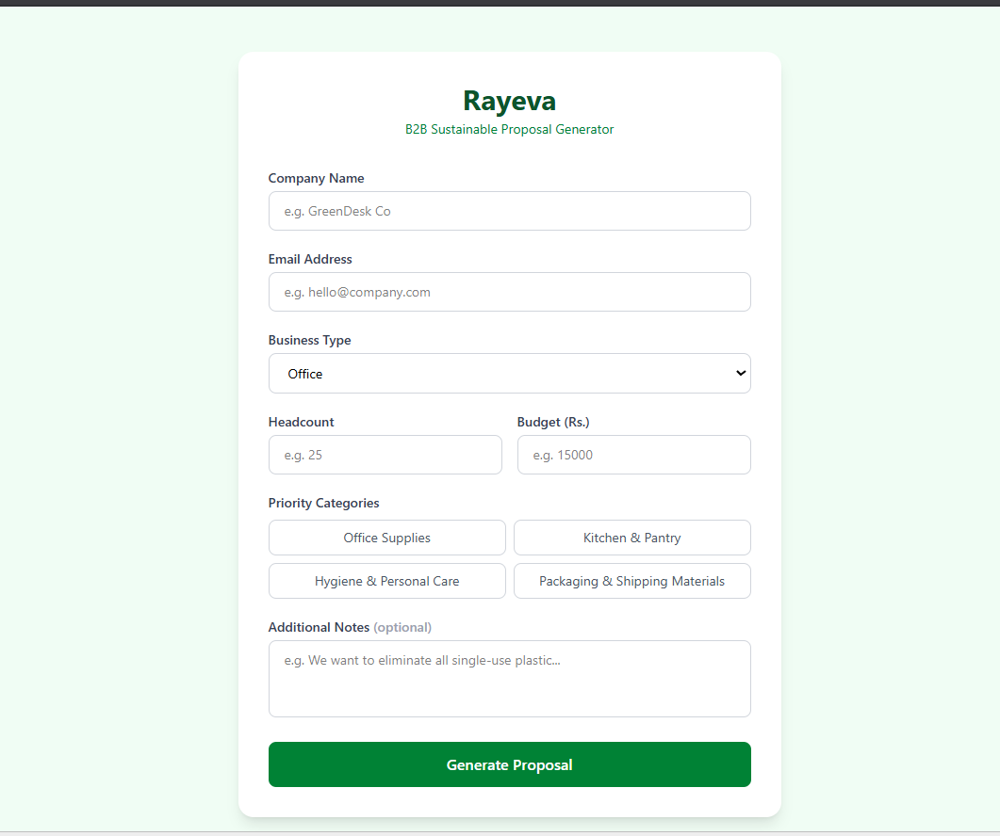
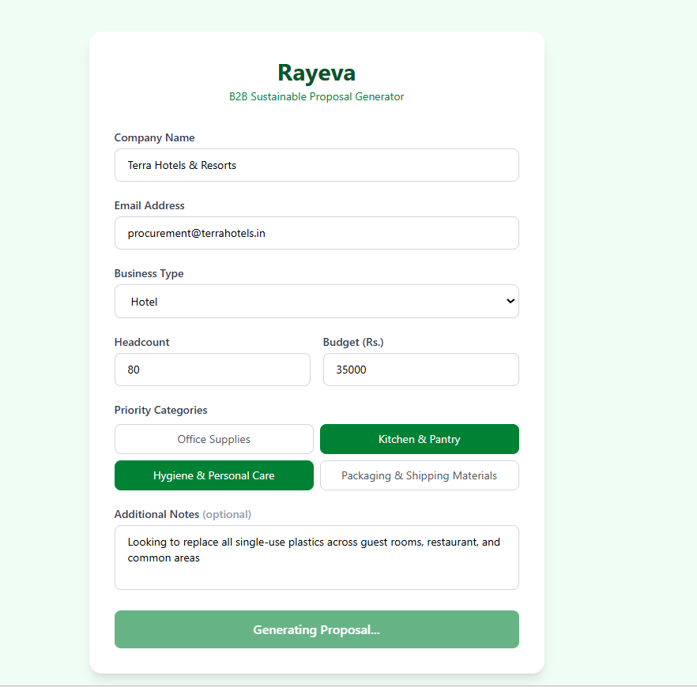
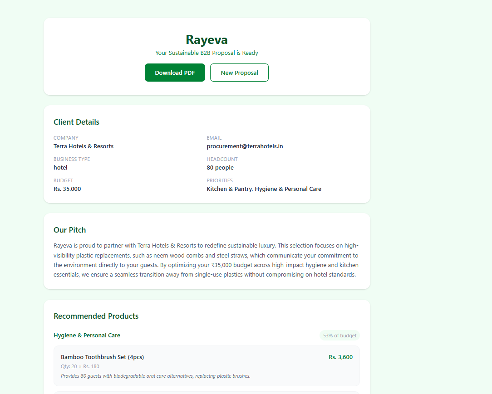
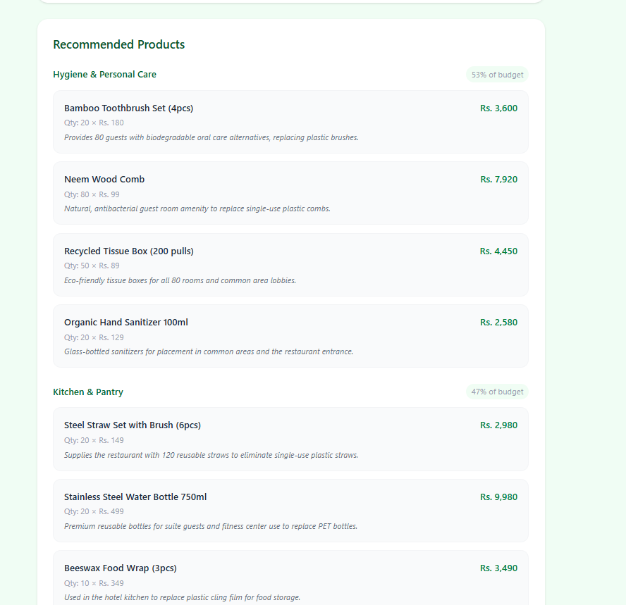
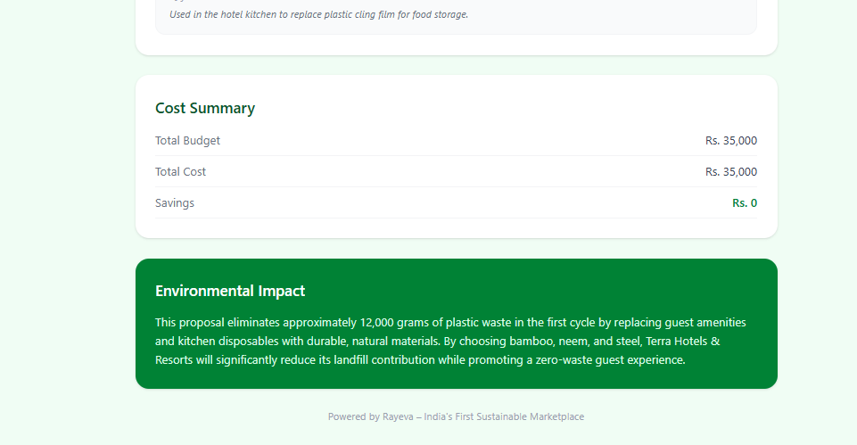

# Module 2 — AI B2B Proposal Generator

> Part of the **Rayeva AI Systems Assignment** — Applied AI for Sustainable Commerce

**Live Demo:** [rayeva-module2.vercel.app](https://rayeva-module2.vercel.app)






---

## What It Does

When a business client wants to switch to sustainable products, this module generates a fully personalized procurement proposal in seconds:

- Selects the most suitable products from Rayeva's catalog based on business type, headcount, and priorities
- Allocates budget intelligently across product categories
- Generates a personalized **proposal narrative** as a sales pitch
- Produces an **environmental impact summary** showing plastic saved
- Saves the full structured proposal to **Supabase**
- Logs every AI prompt and response for auditability
- Exports the proposal as a **downloadable PDF**

No manual curation. No generic quotes. Just fill in the client details and the AI handles the rest.

---

## Tech Stack

| Layer | Technology |
|---|---|
| Backend | Node.js, Express |
| AI | Google Gemini (`gemini-1.5-flash`) |
| Database | Supabase (PostgreSQL) |
| PDF Generation | PDFKit |
| Frontend | React, Vite, Tailwind CSS |
| Hosting | Render (backend), Vercel (frontend) |

---

## Architecture

```
frontend (React + Tailwind)
    │
    │  POST /generate { clientName, clientEmail, businessType,
    │                   headcount, budget, priorities, notes }
    ▼
backend (Express)
    │
    ├── gemini.js      → fetches mock catalog, builds prompt, calls Gemini, parses JSON
    ├── database.js    → saves proposal to Supabase `proposals` table
    │                    fetches mock products from `mock_products` table
    ├── logger.js      → logs prompt + AI response to `proposal_logs` table
    └── pdf.js         → generates styled PDF from saved proposal data
```

### Request Flow

1. Client fills the form on the frontend (company name, email, business type, headcount, budget, priority categories)
2. Frontend sends a `POST /generate` request to the backend
3. Backend fetches all available products from the `mock_products` table
4. Full product catalog is injected into the Gemini prompt as context
5. Gemini selects suitable products, allocates budget, and returns a structured JSON proposal
6. Proposal is saved to the `proposals` table in Supabase
7. Prompt and raw AI response are logged to `proposal_logs`
8. Saved proposal is returned to the frontend and rendered
9. Client can download the proposal as a PDF via `GET /proposal/:id/pdf`

---

## Database Schema

### `mock_products`
| Column | Type | Description |
|---|---|---|
| id | uuid | Primary key |
| name | text | Product name |
| category | text | One of 4 categories |
| unit_price | numeric | Price in Rs. |
| unit | text | per piece / per pack / etc. |
| sustainability_tags | text[] | e.g. plastic-free, compostable |
| plastic_saved_grams | numeric | Estimated plastic saved per unit |
| description | text | Short product description |
| in_stock | boolean | Whether product is available |

### `proposals`
| Column | Type | Description |
|---|---|---|
| id | uuid | Primary key |
| client_name | text | Company name |
| client_email | text | Contact email |
| business_type | text | office / hotel / school / restaurant / other |
| headcount | integer | Number of employees/people |
| budget | numeric | Total budget in Rs. |
| priorities | text[] | Selected product categories |
| additional_notes | text | Optional client notes |
| proposal_json | jsonb | Full Gemini-generated proposal |
| status | text | draft / sent / accepted |
| created_at | timestamptz | Auto timestamp |

### `proposal_logs`
| Column | Type | Description |
|---|---|---|
| id | uuid | Primary key |
| proposal_id | uuid | FK → proposals.id |
| prompt_sent | text | Exact prompt sent to Gemini |
| raw_response | text | Raw Gemini JSON response |
| model_used | text | Model identifier |
| created_at | timestamptz | Auto timestamp |

---

## AI Prompt Design

### Approach

The prompt is built around four principles:

**1. Real Catalog as Context**
Rather than asking Gemini to invent products, the full `mock_products` table is fetched from Supabase and injected into the prompt as a JSON array. This grounds the AI's selections in real inventory — every product recommended actually exists, has a real price, and can be fulfilled. This is the key design decision that separates a useful tool from a hallucination machine.

**2. Strict JSON Schema Output**
Gemini is given the exact JSON structure it must return, with field names, types, and nesting defined explicitly. The `responseMimeType: "application/json"` generation config enforces structured output at the API level, making parsing reliable without any post-processing.

**3. Business Context Injection**
All client details — business type, headcount, budget, priorities, and notes — are injected as variables into the prompt. This gives Gemini the full picture to make contextually appropriate decisions. A hotel with 50 staff gets different recommendations than a school with 200 students.

**4. Dual Natural Language Outputs**
Beyond the structured data, Gemini is asked to generate two pieces of natural language: an `impactSummary` (environmental impact in concrete terms) and a `proposalNarrative` (a personalized sales pitch). These are constrained by length instructions (2-3 sentences and 3-4 sentences respectively) to keep outputs tight and usable.

### The Prompt

```
You are a B2B sales AI for Rayeva, India's first sustainable marketplace.

A business client wants a customized sustainable product proposal.

Client Details:
- Name: {clientName}
- Business Type: {businessType}
- Number of People: {headcount}
- Total Budget: Rs.{budget}
- Priority Categories: {priorities}
- Additional Notes: {additionalNotes}

Available Products (choose from ONLY these):
{full product catalog as JSON}

Instructions:
- Select the most suitable products based on business type, headcount, and priorities
- Allocate budget wisely across categories, do not exceed total budget
- For each product, suggest a realistic quantity based on headcount
- Write a compelling impactSummary (2-3 sentences) about environmental impact
- Write a proposalNarrative (3-4 sentences) as a personalized pitch to the client

Return ONLY a JSON object with exactly this structure:
{
  "clientName": "string",
  "businessType": "string",
  "headcount": number,
  "totalBudget": number,
  "allocations": [
    {
      "category": "string",
      "budgetPercent": number,
      "products": [
        {
          "productId": "string",
          "name": "string",
          "quantity": number,
          "unitPrice": number,
          "subtotal": number,
          "reason": "string"
        }
      ]
    }
  ],
  "totalCost": number,
  "impactSummary": "string",
  "proposalNarrative": "string"
}
```

### Why This Works

- Injecting the real product catalog means Gemini never makes up products or prices — every line item is traceable back to the database
- The strict schema means the response can be directly parsed and saved as JSONB without any cleaning or transformation
- Client context (headcount, business type, notes) lets the model make proportional quantity decisions — 25 bottles for 20 people, not an arbitrary number
- The `reason` field per product forces the model to justify each selection, which makes the proposal more transparent and trustworthy
- JSON mode at the API level eliminates the common failure mode of Gemini wrapping responses in markdown code fences

---

## PDF Design

The PDF is generated server-side using PDFKit with a refined editorial aesthetic:

- Top and bottom forest green accent bars as a document frame
- RAYEVA wordmark in large tracked caps
- Section labels in small tracked uppercase light green
- Two-column layout for client details
- Italic quotes for the proposal narrative
- Green tinted box for the environmental impact summary
- Savings row highlighted in green in the cost summary

---

## Project Structure

```
module2_ai_b2b_proposal_generator/
├── backend/
│   ├── index.js        # Express server, /generate and /proposal/:id/pdf routes
│   ├── gemini.js       # Gemini API integration + prompt construction
│   ├── database.js     # Save proposal + fetch mock products from Supabase
│   ├── logger.js       # AI interaction logging
│   ├── pdf.js          # PDF generation with PDFKit
│   ├── supabase.js     # Supabase client
│   └── package.json
└── frontend/
    ├── src/
    │   ├── pages/
    │   │   ├── ProposalForm.jsx    # Client input form
    │   │   └── ProposalResult.jsx  # Rendered proposal + PDF download
    │   ├── services/
    │   │   └── api.js              # Axios API calls
    │   └── App.jsx
    └── package.json
```

---

## API Endpoints

| Method | Endpoint | Description |
|---|---|---|
| GET | `/` | Health check |
| POST | `/generate` | Generate and save a proposal |
| GET | `/proposal/:id/pdf` | Download proposal as PDF |

---

## Environment Variables

### Backend
```env
PORT=3000
SUPABASE_URL=your_supabase_project_url
SUPABASE_KEY=your_supabase_anon_key
GEMINI_API_KEY=your_gemini_api_key
```

### Frontend
```env
VITE_API_URL=http://localhost:3000
```

---

## Running Locally

```bash
# Backend
cd backend
npm install
node index.js

# Frontend
cd frontend
npm install
npm run dev
```